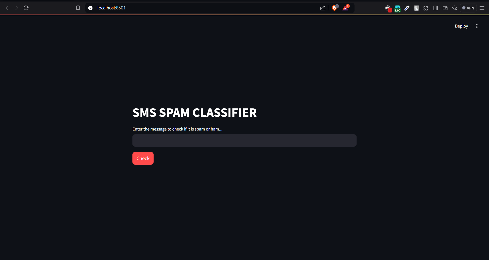
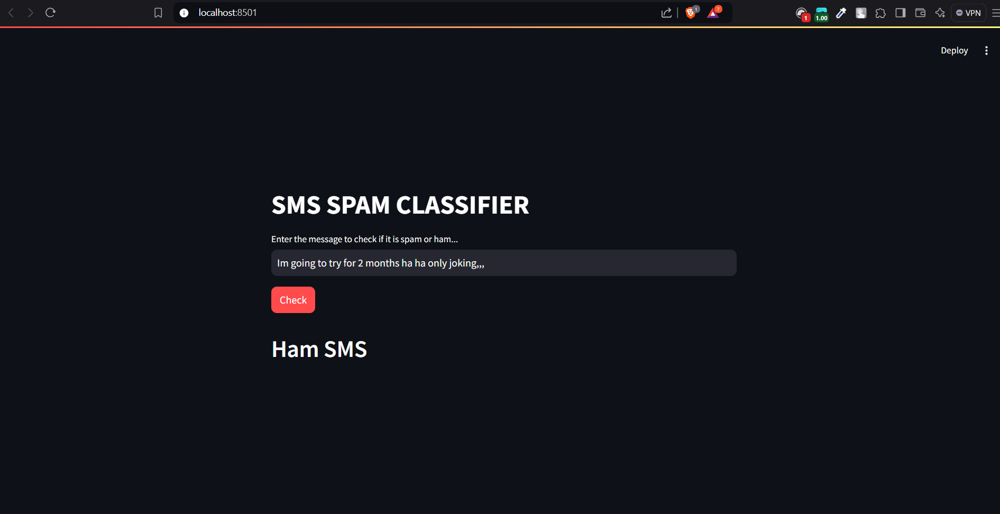
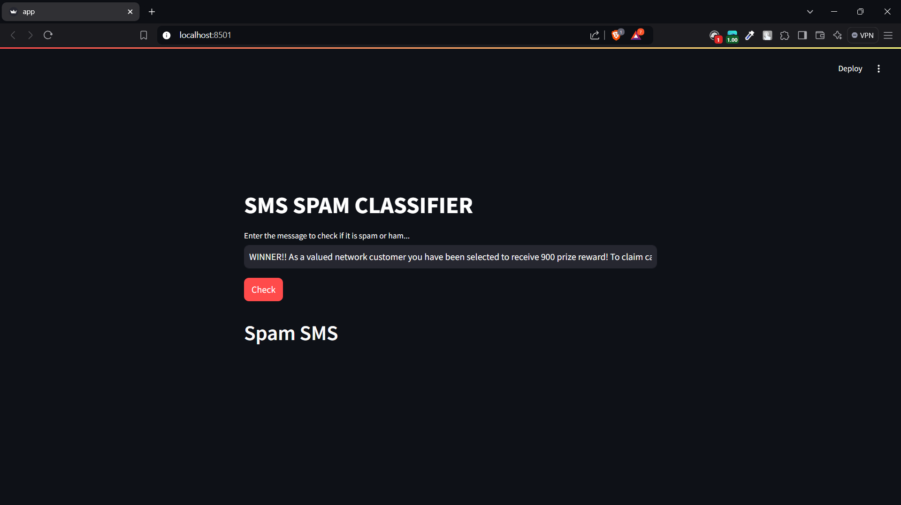

# SMS Spam Classifier
[](https://www.python.org/)
[](https://streamlit.io/)
[](https://scikit-learn.org/)
[](https://pandas.pydata.org/)
[](https://www.nltk.org/)


---

## Introduction



The **SMS Spam Classifier** uses natural language processing techniques to classify SMS messages into "spam" or "ham" categories. The classifier is based on a Naive Bayes algorithm and the TF-IDF vectorization method. The project is deployed using Streamlit for an easy-to-use interface that allows users to input their own SMS messages and receive real-time predictions.[View Demo](https://samirlamichhane10-sms-spam-classifier-app-pg3ofi.streamlit.app/)


---

## Project Structure

```plaintext
SMS_SPAM_CLASSIFIER/
├── dataset/              # Contains datasets
│   └── spam.csv          # The dataset for training the spam classifier
├── saved_models/         # Directory for saving trained models
│   ├── model.pkl         # Trained Naive Bayes model
│   └── vectorizer.pkl    # TF-IDF Vectorizer
├── sms_preprocessing/    # Preprocessing utilities
│   └── preprocess.py     # Script for text preprocessing
├── app.py                # Main application script
├── README.md             # Project README file
├── requirements.txt      # Python dependencies file
├── sample_sms.txt        # Sample file with SMS messages for testing
├── sms_classifier.ipynb  # Jupyter notebook for training and evaluation
├── .gitignore            # Files and folders to ignore in Git
└── LICENSE.txt           # License for the project
```

## File Descriptions

- **`dataset/spam.csv`**: Dataset for training the spam classifier, with labeled SMS messages as spam or ham.
- **`saved_models/model.pkl`**: Pickled Naive Bayes model for making predictions on new SMS messages.
- **`saved_models/vectorizer.pkl`**: TF-IDF vectorizer for transforming SMS text data into numerical format.
- **`sms_preprocessing/preprocess.py`**: Script containing functions for SMS text preprocessing, including cleaning and tokenization.
- **`app.py`**: Main application script for the Streamlit app, allowing real-time SMS classification.
- **`README.md`**: Overview and documentation for the project.
- **`requirements.txt`**: List of Python dependencies required for the project.
- **`sample_sms.txt`**: Sample SMS messages for testing the classifier.
- **`sms_classifier.ipynb`**: Jupyter notebook for training and evaluating the spam classifier.
- **`.gitignore`**: Specifies files and folders to be ignored by Git.
- **`LICENSE.txt`**: Licensing information for the project.

---
## Getting Started

To get a copy of the **SMS Spam Classifier** up and running on your local machine, follow these instructions.

### Prerequisites

Before you begin, ensure you have the following installed on your machine:

- Python 3.8 or higher
- pip (Python package installer)

### Installation & Usage

1. **Clone the repository** to your local machine using the following command:
   ```bash
   git clone https://github.com/yourusername/SMS_SPAM_CLASSIFIER.git
   cd SMS_SPAM_CLASSIFIER
2. **Install the required dependencies** by running:

   ```bash
   pip install -r requirements.txt


3. **Run the Streamlit app**:
   ```bash
   streamlit run app.py
4. **Open your web browser** and navigate to `http://localhost:8501` to access the SMS Spam Classifier interface.

5. **Input your SMS messages** in the provided text box and click on the "Check" button to see if the message is classified as spam or ham.

6. You can also use the `sample_sms.txt` file to test various sample messages.

---
## Project Images 





---
## License

This project is licensed under the MIT License - see the [LICENSE.txt](LICENSE) file for details.

---

## Contact

Your Name - [samirlamichhane10@gmail.com](mailto:samirlamichhane10@gmail.com)  
Project Link: [https://github.com/Samirlamichhane10/sms_spam_classifier](https://github.com/Samirlamichhane10/sms_spam_classifier)

